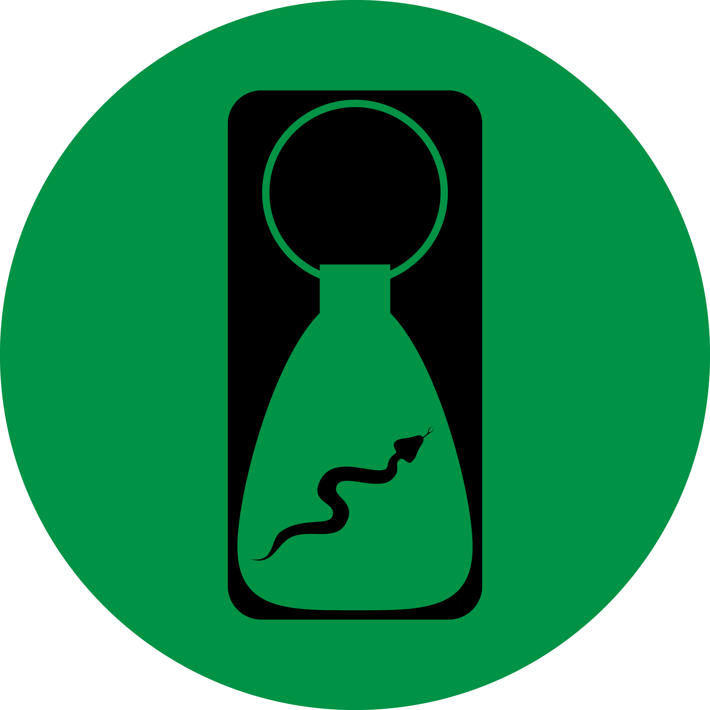

# LGV_UICLEANTIME WIDGET

This is a set of methods and resources that will produce a [UIKit UILabel](https://developer.apple.com/documentation/uikit/uilabel), containing a localizable description of a span of cleantime, or [UIKit UIImage](https://developer.apple.com/documentation/uikit/uiimage/)s, representing keytags or medallions (standard medallions).

[Here is the GitHub repo for the project.](https://github.com/LittleGreenViper/LGV_UICleantime/)

## OVERVIEW

Use these methods and resources to implement a visual, "[skeuomorphic](https://www.techopedia.com/definition/28955/skeuomorphism)," display of the calculations that are generated by the [LGV_Cleantime](https://github.com/LittleGreenViper/LGV_Cleantime/) package (This package depends on that package).

## WHAT PROBLEM DOES THIS SOLVE?

This makes it very easy to provide a visual representation of important NA Recovery milestones. [LGV_Cleantime](https://github.com/LittleGreenViper/LGV_Cleantime/) will calculate them, but this module will display them (only on [iOS](https://apple.com/ios)/[iPadOS](https://apple.com/ipados)).

## IMPLEMENTATION

### Installation

#### [Swift Package Manager (SPM)](https://swift.org/package-manager/):

The URI for the repo is:

- [git@github.com:LittleGreenViper/LGV_UICleantime.git](git@github.com:LittleGreenViper/LGV_UICleantime.git) (SSH), or
- [https://github.com/LittleGreenViper/LGV_UICleantime.git](https://github.com/LittleGreenViper/LGV_UICleantime.git) (HTTPS).

If you want to find out more about SPM, then you might want to [view this series](https://littlegreenviper.com/series/spm/)).

#### [Carthage](https://github.com/Carthage/Carthage):

You can include the library by adding the following line to your [Cartfile](https://github.com/Carthage/Carthage/blob/master/Documentation/Artifacts.md#cartfile):

    github "LittleGreenViper/LGV_UICleantime"
    
### Resources

The package relies on resources that should be provided in a [Localizable.strings](https://github.com/LittleGreenViper/LGV_UICleantime/blob/master/Sources/Resources/Base.lproj/Localizable.strings) file, and [embedded as images](https://github.com/LittleGreenViper/LGV_UICleantime/tree/master/Sources/Resources/Base.lproj/LGV_UICleantime.xcassets) in your app bundle.

These are not being embedded into the package, because it is likely that you will want to mix them with your own localization resources.

### Usage
    
Once you have the package included in your project, you'll need to include the library:

    import LGV_UICleantime

## LICENSE

The code and keytag images are [MIT license](https://opensource.org/licenses/MIT). Use them as you will.

However, the medallion images are renderings of the standard bronze [NA World Services](https://na.org) (NAWS, Inc.) [cleantime commemoration medallions](https://cart-us.na.org/2-keytags-medallions/medallions-bronze/bronze-medallions-bronze). The design of those medallions is copyrighted by NA World Services.

It is important to treat the intellectual property of NA with respect.

